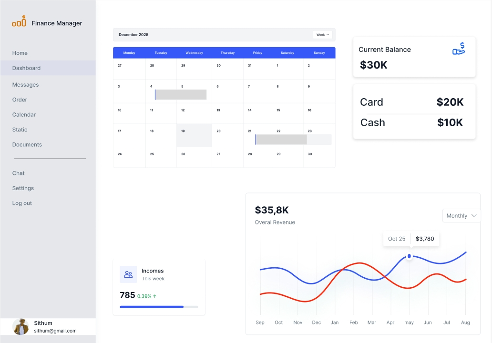

# 📈 Finance Manager App

The **Finance Manager App** is a full-stack application built with **Next.js** that helps users track their personal and business finances. It features intuitive dashboards, transaction tracking,monthly & weekly reports and insightful analytics.

---

## ✨ Features

- User Authentication (Sign In / Sign Up)
- Add, Edit, Delete Transactions
- Financial Reports and Charts
- Category Management
- Responsive Design (Mobile & Desktop)
- Dark/Light Mode Support

---

## 🚀 Tech Stack

- **Frontend**: Next.js 14, React.js, Tailwind CSS
- **Backend**: Next.js API Routes
- **Database**: MongoDB
- **Authentication**: Google Auth
- **Hosting**: Vercel

---

## 🎨 UI/UX Design

View the full UI/UX prototype on Figma:  
👉 [Finance Manager App - Figma Prototype](https://www.figma.com/proto/dDIeiwQ1j5lu1qF7CTiSnH/Finance-Manager-App-UI-UX?node-id=0-1&t=yT3Tm0arWYCGajAY-1)

---

## 🖼️ Wireframes

| Screen          | Wireframe                                                               |
| :-------------- | :---------------------------------------------------------------------- |
| Get Start Page  |   |
| Sign Up Page    |       |
| Home Page       |       |
| Dashboard Modal |  |

> _📎 Note: Place your wireframe images inside a `/wireframes` folder in the project root._

---

## 🛠️ Installation

1. **Clone the repository**

```bash
git clone https://github.com/sithum-sandaruwan/Finance-Manager-App-Fe.git
```
